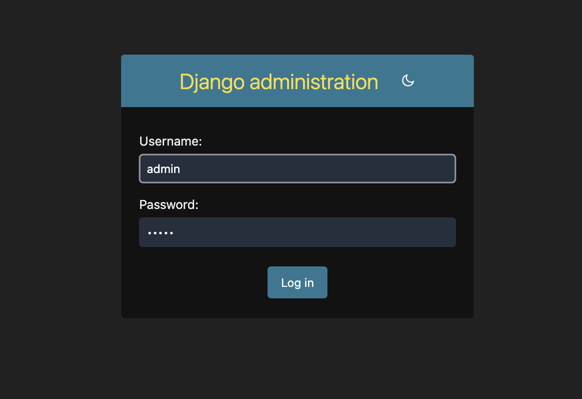
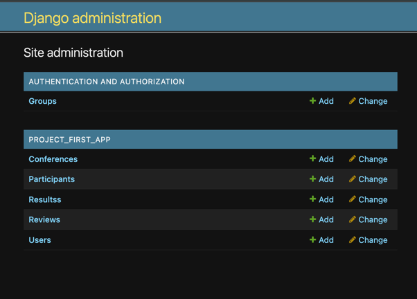

## Создание и регистрация моделей:
На данном этапе создаю и регистрирую модели, а также создаю superuser пользователя.

Models.py:
```python
from django.db import models
from django.contrib.auth.models import AbstractUser


class User(AbstractUser):
    birth_date = models.DateField(null=True, blank=True)
    age = models.CharField(max_length=3)
    groups = models.ManyToManyField('auth.Group', blank=True)
    user_permissions = models.ManyToManyField('auth.Permission', blank=True)

class Conference(models.Model):
    title = models.CharField(max_length=300)
    themes = models.TextField(help_text="Список тематик через запятую")
    location = models.CharField(max_length=255)
    start_date = models.DateField()
    end_date = models.DateField()
    description = models.TextField()
    location_description = models.TextField()

class Review(models.Model):
    conference = models.ForeignKey(Conference, on_delete=models.CASCADE)
    user = models.ForeignKey(User, on_delete=models.CASCADE)
    comment = models.TextField()
    rating = models.IntegerField(choices=[(i, i) for i in range(1, 11)])
    date_added = models.DateTimeField(auto_now_add=True)

class Participant(models.Model):
    conference = models.ForeignKey(Conference, on_delete=models.CASCADE)
    user = models.ForeignKey(User, on_delete=models.CASCADE)
    is_author = models.BooleanField(default=False)

class Results(models.Model):
    participant = models.ForeignKey(Participant, on_delete=models.CASCADE)
    accepted = models.BooleanField(default=False)

```

Admin.py:
```python
from django.contrib import admin
from .models import User, Conference, Review, Participant, Results

admin.site.register(User)
admin.site.register(Conference)
admin.site.register(Review)
admin.site.register(Participant)
admin.site.register(Results)
```

Далее я создаю миграции командами:
```bash
python manage.py makemigrations
python manage.py migrate
```
Создаю суперпользователя admin:
```bash
python manage.py createsuperuser
```


