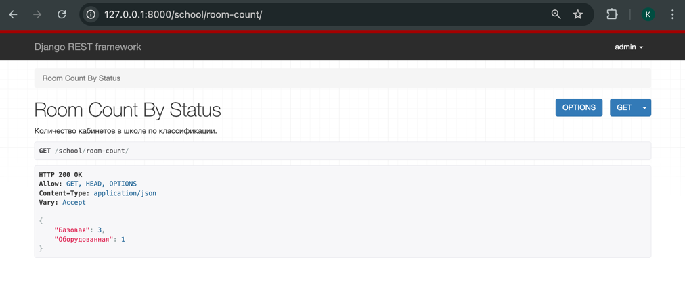

## РЕАЛИЗАЦИЯ СЕРВЕРНОЙ ЧАСТИ ПРИЛОЖЕНИЯ СРЕДСТВАМИ DJANGO И DJANGORESTFRAMEWORK
### База данных:

### Реализовать модель базы данных средствами DjangoORM:
```python
from django.core.validators import MaxValueValidator, MinValueValidator
from django.db import models

class Student(models.Model):
    GENDER_CHOICES = [
        ('М', 'Мужской'),
        ('Ж', 'Женский'),
    ]
    id_student = models.AutoField(primary_key=True)
    surname = models.CharField(max_length=20)
    name = models.CharField(max_length=20)
    gender = models.CharField(max_length=1, choices=GENDER_CHOICES)
    class_name = models.CharField(max_length=3)

    def __str__(self):
        return f"{self.surname} {self.name} ({self.class_name})"


class Grade(models.Model):
    id_grade = models.AutoField(primary_key=True)
    student = models.ForeignKey(Student, on_delete=models.CASCADE)
    subject = models.CharField(max_length=30)
    grade = models.PositiveSmallIntegerField(validators=[MinValueValidator(1), MaxValueValidator(5)])
    quarter = models.PositiveSmallIntegerField(validators=[MinValueValidator(1), MaxValueValidator(4)])

    def __str__(self):
        return f"{self.student} | {self.subject}: {self.grade} (Quarter {self.quarter})"


class StudentSchedule(models.Model):
    id_schedule = models.AutoField(primary_key=True)
    student = models.ForeignKey(Student, on_delete=models.CASCADE)
    lessons = models.ManyToManyField('Lesson')

    def __str__(self):
        lessons_list = ', '.join(lesson.subject for lesson in self.lessons.all())
        return f"Schedule for {self.student}: {lessons_list}"


class Teacher(models.Model):
    id_teacher = models.AutoField(primary_key=True)
    surname = models.CharField(max_length=20)
    name = models.CharField(max_length=20)
    room_assigned = models.ForeignKey(
        'Room', null=True, on_delete=models.SET_NULL, related_name='assigned_teachers'
    )
    lessons = models.ManyToManyField('Lesson', related_name='taught_by', blank=True)

    def __str__(self):
        room_info = f"Room: {self.room_assigned}" if self.room_assigned else "No assigned room"
        return f"{self.surname} {self.name} ({room_info})"


class Room(models.Model):
    ROOM_STATUS_CHOICES = [
        ('Оборудованная', 'Оборудованная'),
        ('Базовая', 'Базовая'),
    ]
    id_room = models.AutoField(primary_key=True)
    number = models.CharField(max_length=20)
    status = models.CharField(max_length=15, choices=ROOM_STATUS_CHOICES)
    teacher = models.ManyToManyField(Teacher, blank=True, related_name='rooms')

    def __str__(self):
        return f"{self.number} ({self.get_status_display()})"


class Lesson(models.Model):
    DAY_CHOICES = [
        ('Понедельник', 'Понедельник'),
        ('Вторник', 'Вторник'),
        ('Среда', 'Среда'),
        ('Четверг', 'Четверг'),
        ('Пятница', 'Пятница'),
        ('Суббота', 'Суббота'),
    ]
    NUM_LESSON = [
        ('1', '1'),
        ('2', '2'),
        ('3', '3'),
        ('4', '4'),
        ('5', '5'),
        ('6', '6'),
        ('7', '7'),
        ('8', '8'),
    ]
    id_lesson = models.AutoField(primary_key=True)
    day = models.CharField(max_length=20, choices=DAY_CHOICES)
    lesson_number = models.CharField(max_length=2, choices=NUM_LESSON)
    subject = models.CharField(max_length=20)
    class_label = models.CharField(max_length=3)
    teacher = models.ForeignKey(Teacher, on_delete=models.CASCADE, related_name='teaches')
    room = models.ForeignKey(Room, on_delete=models.CASCADE, related_name='lessons')

    def __str__(self):
        return f"{self.subject} ({self.class_label}) | {self.day} Lesson {self.lesson_number}"
```

### Реализовать логику работу API средствами Django REST Framework: 

serializers.py:
```python
from rest_framework import serializers
from .models import Student, Teacher, Grade, Lesson, Room, StudentSchedule

class StudentSerializer(serializers.ModelSerializer):
    class Meta:
        model = Student
        fields = '__all__'

class TeacherSerializer(serializers.ModelSerializer):
    lessons = serializers.PrimaryKeyRelatedField(
        queryset=Lesson.objects.all(),
        many=True,
        required=False,
        allow_null=True
    )

    class Meta:
        model = Teacher
        fields = '__all__'

class GradeSerializer(serializers.ModelSerializer):
    class Meta:
        model = Grade
        fields = '__all__'

class LessonSerializer(serializers.ModelSerializer):
    class Meta:
        model = Lesson
        fields = '__all__'

class RoomSerializer(serializers.ModelSerializer):
    teacher = serializers.PrimaryKeyRelatedField(
        queryset=Teacher.objects.all(),
        many=True,
        required=False,
        allow_null=True
    )

    class Meta:
        model = Room
        fields = '__all__'

class StudentScheduleSerializer(serializers.ModelSerializer):
    class Meta:
        model = StudentSchedule
        fields = '__all__'
```
views.py:

```python
from django.db.models import Count
from requests import Response
from rest_framework.response import Response
from rest_framework.generics import ListCreateAPIView, RetrieveUpdateDestroyAPIView
from rest_framework.views import APIView
from .serializers import *

class StudentListCreateView(ListCreateAPIView):
    queryset = Student.objects.all()
    serializer_class = StudentSerializer

class StudentDetailView(RetrieveUpdateDestroyAPIView):
    queryset = Student.objects.all()
    serializer_class = StudentSerializer

class TeacherListCreateView(ListCreateAPIView):
    queryset = Teacher.objects.all()
    serializer_class = TeacherSerializer

class TeacherDetailView(RetrieveUpdateDestroyAPIView):
    queryset = Teacher.objects.all()
    serializer_class = TeacherSerializer

class GradeListCreateView(ListCreateAPIView):
    queryset = Grade.objects.all()
    serializer_class = GradeSerializer

class LessonListCreateView(ListCreateAPIView):
    queryset = Lesson.objects.all()
    serializer_class = LessonSerializer

class LessonDetailView(RetrieveUpdateDestroyAPIView):
    queryset = Lesson.objects.all()
    serializer_class = LessonSerializer

class RoomListCreateView(ListCreateAPIView):
    queryset = Room.objects.all()
    serializer_class = RoomSerializer

class RoomDetailView(RetrieveUpdateDestroyAPIView):
    queryset = Room.objects.all()
    serializer_class = RoomSerializer

class StudentScheduleListCreateView(ListCreateAPIView):
    queryset = StudentSchedule.objects.all()
    serializer_class = StudentScheduleSerializer

class StudentScheduleDetailView(RetrieveUpdateDestroyAPIView):
    queryset = StudentSchedule.objects.all()
    serializer_class = StudentScheduleSerializer

class SubjectInRoomView(APIView):
    "Список предметов, которые проводятся в указанной комнате в указанный день недели."
    def get(self, request, room_number, day):
        lessons = Lesson.objects.filter(room__number=room_number, day=day)
        if lessons.exists():
            data = [
                {
                    "subject": lesson.subject,
                    "class": lesson.class_label,
                    "lesson_number": lesson.lesson_number
                } for lesson in lessons
            ]
            return Response(data)
        else:
            return Response({"error": "No lessons found for the specified room and day"}, status=404)

class TeachersPerSubjectView(APIView):
    "Количество учителей, преподающих каждый предмет, имена и фамилии."
    def get(self, request):
        subjects = Lesson.objects.values('subject').annotate(teacher_count=Count('teacher', distinct=True))
        result = []
        for subject in subjects:
            subject_name = subject['subject']
            teachers = Lesson.objects.filter(subject=subject_name).values(
                'teacher__name', 'teacher__surname'
            ).distinct()
            teacher_list = [
                {"name": teacher['teacher__name'], "surname": teacher['teacher__surname']}
                for teacher in teachers
            ]
            result.append({
                "subject": subject_name,
                "teacher_count": subject['teacher_count'],
                "teachers": teacher_list
            })
        return Response(result)

class GenderCountPerClassView(APIView):
    "Количество мальчиков и девочек в каждом классе."
    def get(self, request):
        gender_counts = (
            Student.objects.values('class_name', 'gender')
            .annotate(count=Count('id_student'))
        )
        result = {}
        for item in gender_counts:
            class_name = item['class_name']
            if class_name not in result:
                result[class_name] = {"boys": 0, "girls": 0}
            if item['gender'] == 'М':
                result[class_name]["boys"] = item['count']
            elif item['gender'] == 'Ж':
                result[class_name]["girls"] = item['count']
        return Response(result)

class RoomCountByStatusView(APIView):
    "Количество кабинетов в школе по классификации."
    def get(self, request):
        room_counts = (
            Room.objects.values('status')
            .annotate(count=Count('id_room'))
        )
        result = {item['status']: item['count'] for item in room_counts}
        return Response(result)

class TeachersWithSameSubjectsView(APIView):
    "Список учителей, которые преподают те же предметы, что и указанный учитель по id."
    def get(self, request, teacher_id):
        teacher = Teacher.objects.get(id_teacher=teacher_id)
        subjects = teacher.lessons.values_list('subject', flat=True)
        teachers_with_same_subjects = Teacher.objects.filter(lessons__subject__in=subjects).exclude(id_teacher=teacher_id)
        teacher_list = [
            {"name": t.surname + " " + t.name} for t in teachers_with_same_subjects
        ]
        return Response(teacher_list)

class StudentScheduleView(APIView):
    "Расписание для ученика по id."
    def get(self, request, student_id):
        try:
            student_schedule = StudentSchedule.objects.get(student_id=student_id)
            student = Student.objects.get(id_student=student_id)
            lessons = student_schedule.lessons.all()
            schedule_data = {
                "student_name": f"{student.surname} {student.name}",
                "class_name": student.class_name,
                "lessons": [{"subject": lesson.subject, "day": lesson.day, "lesson_number": lesson.lesson_number} for
                            lesson in lessons]
            }

            return Response(schedule_data)

        except StudentSchedule.DoesNotExist:
            return Response({"error": "Schedule not found for the given student"}, status=404)
        except Student.DoesNotExist:
            return Response({"error": "Student not found"}, status=404)

class GradeListView(APIView):
    "Оценки для ученика по id."
    def get(self, request, student_id):
        grades = Grade.objects.filter(student_id=student_id)
        student = Student.objects.get(id_student=student_id)
        if grades.exists():
            grade_data = [
                {
                    "student_name": f"{student.surname} {student.name}",
                    "subject": grade.subject,
                    "grade": grade.grade,
                    "quarter": grade.quarter
                }
                for grade in grades
            ]
            return Response(grade_data)
        else:
            return Response({"error": "Grades not found for the given student"}, status=404)
```

### Подключить регистрацию / авторизацию по токенам / вывод информации о текущем пользователе средствами Djoser:  

```python
REST_FRAMEWORK = {
    'DEFAULT_AUTHENTICATION_CLASSES': (
        'rest_framework.authentication.TokenAuthentication',
        'rest_framework.authentication.SessionAuthentication'
    ),
    'DEFAULT_PERMISSION_CLASSES': (
        'rest_framework.permissions.IsAuthenticated',
    ),
}

DJOSER = {
    'USER_CREATE_PASSWORD_RETYPE': True,
    'LOGIN_FIELD': 'username',
    'TOKEN_MODEL': 'rest_framework.authtoken.models.Token'

}
```
urls.py:
```python
    path("auth/", include("djoser.urls")),
    path("auth/", include("djoser.urls.authtoken")),
    path("api-auth/", include("rest_framework.urls")),
```

### Эндпоинты:  
Список предметов, которые проводятся в указанной комнате в указанный день недели.

  
Количество учителей, преподающих каждый предмет, имена и фамилии.  

  
Количество мальчиков и девочек в каждом классе.  

  
Количество кабинетов в школе по классификации. 
  
  
Список учителей, которые преподают те же предметы, что и указанный учитель по id.  


Расписание для ученика по id.  
  
  
Оценки для ученика по id.  
  

