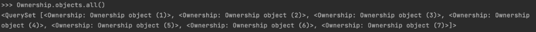
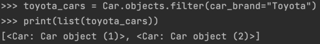
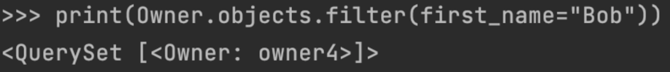
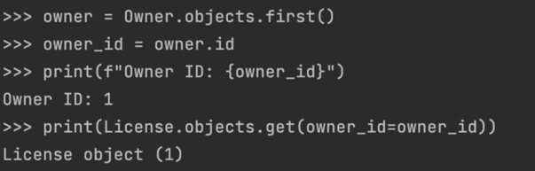
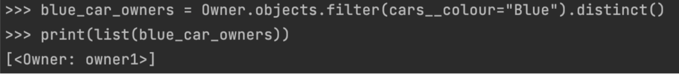
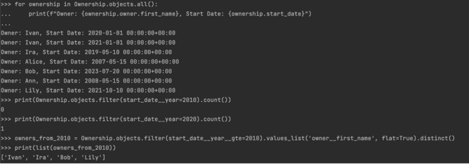

## Практическая работа №3.1
### Практическое задание 1  
Воспользуйтесь проектом из практики 2.1:
Напишите запрос на создание 6-7 новых автовладельцев и 5-6 автомобилей, 
каждому автовладельцу назначьте удостоверение и от 1 до 3 автомобилей. 
Задание можете выполнить либо в интерактивном режиме интерпретатора, 
либо в отдельном python-файле. Результатом должны стать запросы и отображение 
созданных объектов. 

```
>>> from project_first_app.models import *
>>> Owner.objects.all()
<QuerySet []>
>>> License.objects.all()
<QuerySet []>
>>> Car.objects.all()
<QuerySet []>
>>> Ownership.objects.all()
<QuerySet []>
```




### Практическое задание 2
1) Выведете все машины марки “Toyota”  
  
2) Все водители по имени Bob  
  
3) Взяв любого случайного владельца получить его id, 
и по этому id получить экземпляр удостоверения
в виде объекта модели (можно в 2 запроса)  
  
4) Вывести всех владельцев красных машин 
(или любого другого цвета, который у вас присутствует)  
  
5) Найти всех владельцев, чей год владения машиной 
начинается с 2010 (или любой другой год, который присутствует у вас в базе)  
  