## Интерфейсы

Вариант: Система для завуча школы

1. Список учеников:
Форма добавления нового ученика  -> кнопка "Сохранить" добавляет ученика в базу.
При нажатии на имя ученика в списке происходит переход на детальную страницу (общая информация, оценки по четвертям). Кнопки "Удалить" и "Редактировать" личную информацию об ученике.
Поиск по фамилии фильтрует список учеников.

2. Список учителей:
Форма добавления нового учителя  -> кнопка "Сохранить" добавляет учителя.
При нажатии на учителя в списке переход на детальную страницу (общая информация, расписание уроков). Кнопки "Удалить" и "Редактировать" личную информацию.
Поиск по фамилии.

3. Кабинеты:
Форма добавления нового кабинета -> Кнопка "Сохранить" добавляет кабинет.
Карточки кабинетов:
Содержат номер кабинета, статус (оборудованный/базовый).
При нажатии на карточку кабинета появляется модальное окно с детальной информацией, где отображаются: Список уроков, проходящих в этом кабинете по дням недели. Кнопкf: "Удалить".

4. Уроки:
Форма добавления нового урока -> Кнопка "Сохранить" добавляет урок.
Карточки уроков по дням недели:
При клике на урок происходит переход на модальное окно: номер урока, предмет, учитель, кабинет, день недели. Кнопки: "Редактировать" и "Удалить"

5. Оценки
Форма добавления новой оценки. 
Список оценок: Ученик, Предмет, Оценка, Четверть.
Фильтры: Ученик (поиск/выпадающий список), Предмет (выпадающий список).
При клике на карточку открывается окно с информацией об оценке и кнопки: "Редактировать" и "Удалить" 

6. Отчеты
Выбор класса для генерации отчета (количество мальчиков/девочек, список учеников, список уроков)

## Реализация
### Настройка CORS в Django REST framework
Для начала я установила пакет django-cors-headers.
```python
pip install django-cors-headers

```
Затем настроила settings.py 
Разрешение для всех доменов подключаться к Django-приложению. Включение True чтобы любой домен мог делать запросы к серверу.

Добавляю middleware - CorsMiddleware, которое обрабатывает CORS-заголовки для запросов. Он проверяет заголовки запросов и добавляет необходимые CORS-заголовки в ответ.
```python
CORS_ORIGIN_ALLOW_ALL = True

MIDDLEWARE = [
    'corsheaders.middleware.CorsMiddleware',
    
INSTALLED_APPS = [
    ...
    "corsheaders"
]
```

### Реализация интерфейсов
Настроила маршрутизацию:
```python
import { createRouter, createWebHistory } from 'vue-router';
import LoginView from '@/views/LoginView.vue';
import StudentList from '@/views/StudentList.vue';
import StudentDetail from '@/views/StudentDetail.vue';
import TeachersList from '@/views/TeachersList.vue';
import TeacherDetail from '@/views/TeacherDetail.vue';
import RoomsList from '@/views/RoomsList.vue';
import Lessons from '@/views/Lessons.vue';
import Grades from '@/views/Grades.vue';
import RegistrationView from '@/views/RegistrationView.vue';
import HomeView from '@/views/HomeView.vue';
import Report from '@/views/Report.vue';

const routes = [
  { path: '/home', name: 'Home', component: HomeView },
  { path: '/register', name: 'Registration', component: RegistrationView },
  { path: '/login', name: 'Login', component: LoginView },
  { path: '/students', name: 'StudentList', component: StudentList, meta: { requiresAuth: true } },
  { path: '/students/:id', name: 'StudentDetail', component: StudentDetail, props: true, meta: { requiresAuth: true } },
  { path: '/teachers', name: 'TeachersList', component: TeachersList, meta: { requiresAuth: true } },
  { path: '/teachers/:id', name: 'TeacherDetail', component: TeacherDetail, props: true, meta: { requiresAuth: true } },
  { path: '/rooms', name: 'RoomsList', component: RoomsList, meta: { requiresAuth: true } },
  { path: '/lessons', name: 'Lessons', component: Lessons, meta: { requiresAuth: true } },
  { path: '/grades', name: 'Grades', component: Grades, meta: { requiresAuth: true } },
  { path: '/report', name: 'Report', component: Report, meta: { requiresAuth: true } },
];

const router = createRouter({
  history: createWebHistory(),
  routes,
});

router.beforeEach((to, from, next) => {
  const isAuthenticated = localStorage.getItem('authToken');
  if (to.matched.some(record => record.meta.requiresAuth)) {
    if (!isAuthenticated) {
      next({ name: 'Login' });
    } else {
      next();
    }
  } else {
    next();
  }
});
export default router;
```
authToken.js - для взаимодействия с сервером, предоставляя функции для логина и логаута.
```python
import axios from 'axios';

const BASE_URL = 'http://127.0.0.1:8000/auth/token/login/';

export default {
  login(credentials) {
    return axios.post(BASE_URL, credentials)
      .then(response => {
        const token = response.data.auth_token;
        console.log('Token:', token);
        localStorage.setItem('token', token);
        return token;
      })
      .catch(error => {
        console.error('Ошибка при логине:', error);
        throw error;
      });
  },
  logout() {
    localStorage.removeItem('token');
  },
};
```

loginView.vue:
```
<template>
  <div>
    <Header />
    <div class="login-container">
      <h1 class="page-title">Вход</h1>
      <form @submit.prevent="loginUser">
        <div class="form-group">
          <label for="username" class="form-label">Username</label>
          <input
            v-model="form.email"
            type="username"
            id="username"
            placeholder="Введите username"
            class="form-input"
            required
          />
        </div>

        <div class="form-group">
          <label for="password" class="form-label">Пароль</label>
          <input
            v-model="form.password"
            type="password"
            id="password"
            placeholder="Введите пароль"
            class="form-input"
            required
          />
        </div>
        <button type="submit" class="login-button">Войти</button>
      </form>
      <p v-if="error" class="error">{{ error }}</p>
    </div>
  </div>
</template>

<script>
import axios from "axios";
import Header from "@/components/Header.vue";

export default {
  components: {
    Header,
  },
  data() {
    return {
      form: {
        email: "",
        password: "",
      },
      error: null,
    };
  },
  methods: {
    async loginUser() {
      try {
        const response = await axios.post("http://127.0.0.1:8000/auth/token/login/", {
          username: this.form.email,
          password: this.form.password
        });

        const token = response.data.auth_token;
        localStorage.setItem("authToken", token);
        alert("Вход выполнен успешно!");
        this.$router.push("/home");
      } catch (error) {
        this.error = "Ошибка при входе. Проверьте данные.";
        console.error(error);
      }
    },
  },
};
</script>
```
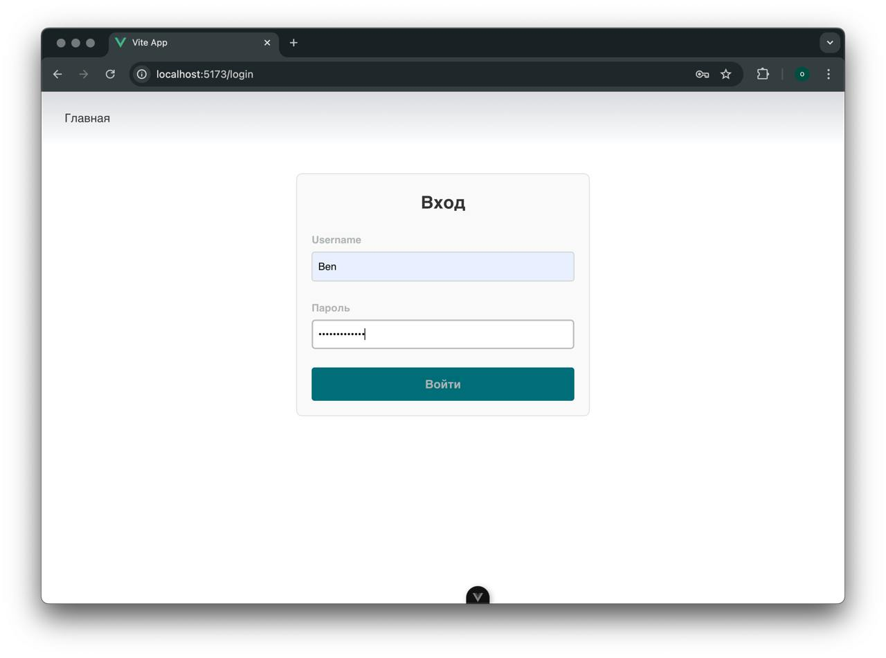
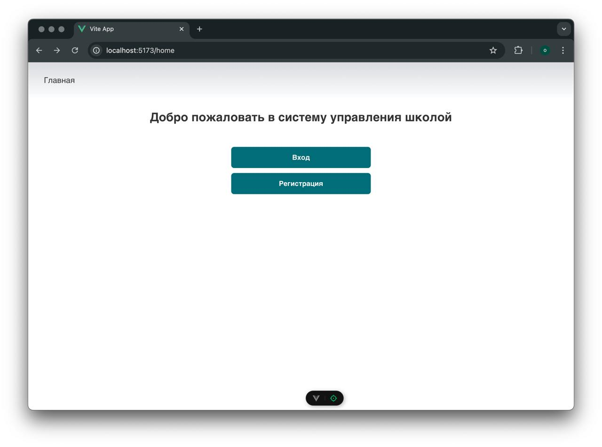
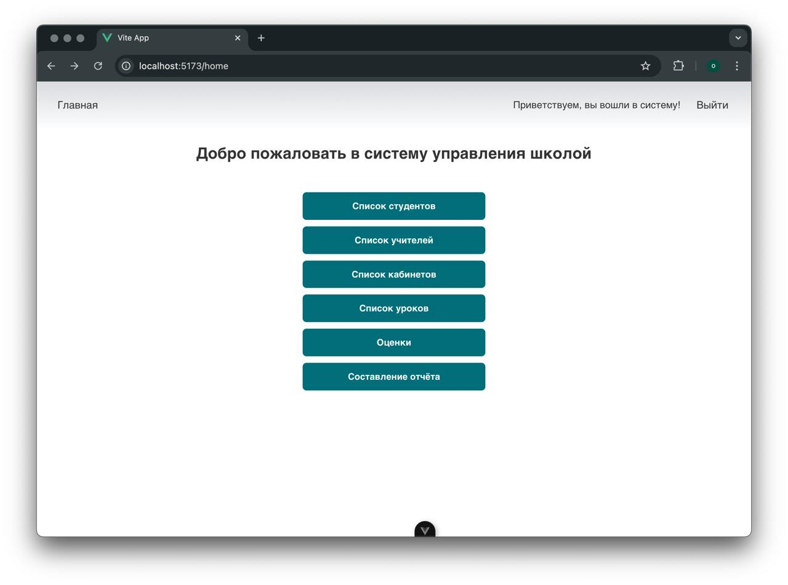

Затем приведу примеры реализаций интерфейсов.

StudentsList.vue
```
<template>
  <Header />
  <div class="page-container">
    <div class="header-container">
      <h1 class="page-title">Список учеников</h1>
      <button @click="showAddStudentModal = true" class="add-button">Добавить ученика</button>
    </div>

    <div class="search-container">
      <input
        v-model="searchQuery"
        type="text"
        placeholder="Поиск по фамилии"
        class="search-input"
      />
    </div>

    <div class="table-wrapper">
      <table class="student-table">
        <thead>
          <tr>
            <th>Фамилия Имя</th>
            <th>Класс</th>
          </tr>
        </thead>
        <tbody>
          <tr v-for="student in filteredStudents" :key="student.id">
            <td>
              <router-link :to="`/students/${student.id_student}`" class="student-link">
                {{ student.surname }} {{ student.name }}
              </router-link>
            </td>
            <td>{{ student.class_name }}</td>
          </tr>
        </tbody>
      </table>
    </div>
  </div>
  <div v-if="showAddStudentModal" class="modal-overlay">
    <div class="modal-content">
      <form @submit.prevent="addStudent">
        <input v-model="newStudent.surname" type="text" placeholder="Фамилия" required />
        <input v-model="newStudent.name" type="text" placeholder="Имя" required />
        <input v-model="newStudent.class_name" type="text" placeholder="Класс" required />
        <div class="gender-select">
          <span>Выберите пол:</span>
          <button
            type="button"
            class="gender-option"
            :class="{ active: newStudent.gender === 'М' }"
            @click="selectGender('М')"
          >
            М
          </button>
          <button
            type="button"
            class="gender-option"
            :class="{ active: newStudent.gender === 'Ж' }"
            @click="selectGender('Ж')"
          >
            Ж
          </button>
        </div>
        <div class="modal-actions">
          <button type="submit" class="save-button">Сохранить</button>
          <button @click="closeModal" type="button" class="cancel-button">Отмена</button>
        </div>
      </form>
    </div>
  </div>
</template>


<script>
import Header from '@/components/Header.vue';
import apiClient from '@/api/axios';

export default {
  components: {
    Header,
  },
  data() {
    return {
      students: [],
      searchQuery: '',
      newStudent: {
        surname: '',
        name: '',
        class_name: '',
        gender: '',
      },
      showAddStudentModal: false,
    };
  },
  computed: {
    filteredStudents() {
      if (!this.searchQuery) {
        return this.students;
      }
      return this.students.filter((student) =>
        student.surname.toLowerCase().includes(this.searchQuery.toLowerCase())
      );
    },
  },
  created() {
    this.fetchStudents();
  },
  methods: {
    selectGender(gender) {
      this.newStudent.gender = gender;
    },
    async fetchStudents() {
      try {
        const response = await apiClient.get('students/');
        this.students = response.data;
      } catch (error) {
        console.error('Ошибка при получении списка учеников:', error);
      }
    },
    async addStudent() {
      try {
        const response = await apiClient.post('students/', this.newStudent);
        this.students.push(response.data);
        this.closeModal();
      } catch (error) {
        console.error('Ошибка при добавлении ученика:', error);
      }
    },
    closeModal() {
      this.showAddStudentModal = false;
    },
  },
};
</script>
```
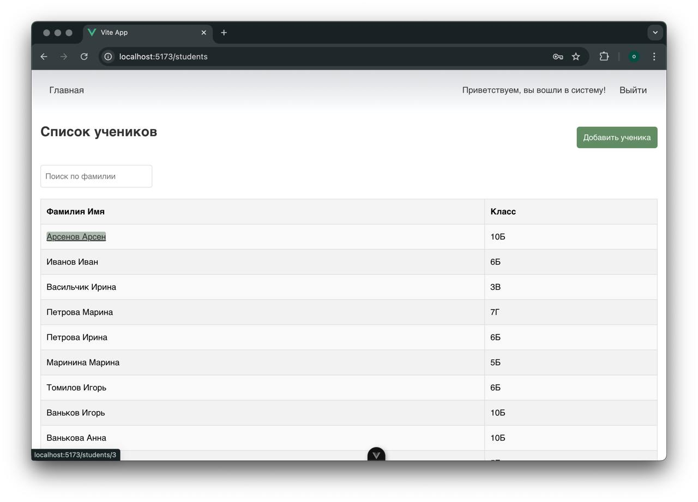
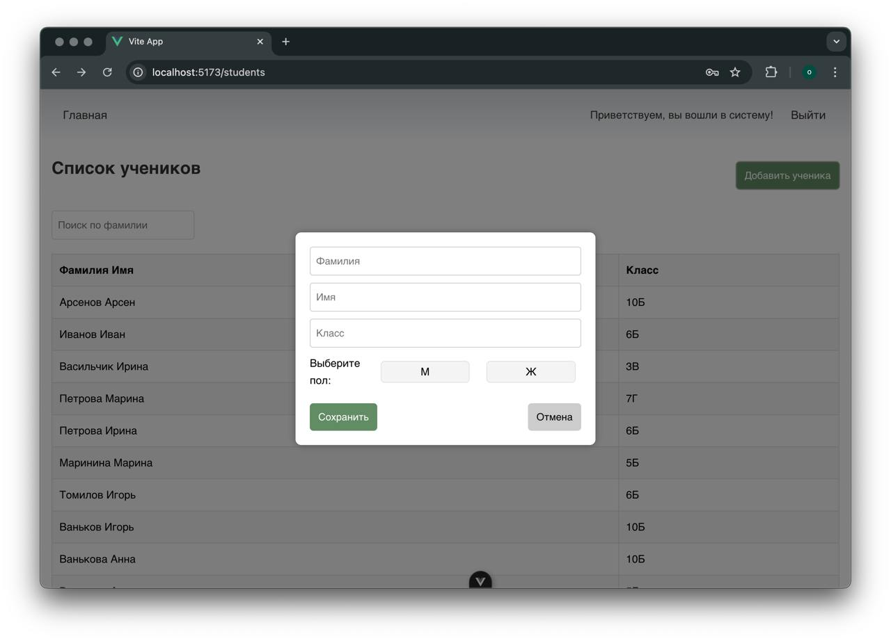
StudentDetail.vue
```
<template>
  <div>
    <Header />
    <div class="page-container">
      <h1 class="page-title">Детальная информация об ученике</h1>
      <div v-if="student" class="student-info">
        <p><strong>Фамилия:</strong> {{ student.surname }}</p>
        <p><strong>Имя:</strong> {{ student.name }}</p>
        <p><strong>Класс:</strong> {{ student.class_name }}</p>
        <p><strong>Пол:</strong> {{ student.gender }}</p>
        <div class="button-group">
          <button @click="toggleEditForm" class="edit-button">Редактировать</button>
          <button @click="deleteStudent" class="delete-button">Удалить</button>
        </div>
      </div>
      <div v-if="showEditForm" class="edit-form">
        <h2>Редактировать ученика</h2>
        <form @submit.prevent="updateStudent">
          <input v-model="editedStudent.surname" type="text" placeholder="Фамилия" required />
          <input v-model="editedStudent.name" type="text" placeholder="Имя" required />
          <input v-model="editedStudent.class_name" type="text" placeholder="Класс" required />
          <div class="gender-buttons">
            <button
              :class="{'active': editedStudent.gender === 'М'}"
              @click.prevent="setGender('М')"
              class="gender-button">
              М
            </button>
            <button
              :class="{'active': editedStudent.gender === 'Ж'}"
              @click.prevent="setGender('Ж')"
              class="gender-button">
              Ж
            </button>
          </div>

          <div class="form-actions">
            <button type="submit" class="save-button">Сохранить</button>
            <button @click="cancelEdit" type="button" class="cancel-button">Отмена</button>
          </div>
        </form>
      </div>
      <div v-else-if="grades.length > 0" class="grades-container">
        <h2>Оценки</h2>
        <table class="grades-table">
          <thead>
            <tr>
              <th>Предмет</th>
              <th>Оценка</th>
              <th>Четверть</th>
            </tr>
          </thead>
          <tbody>
            <tr v-for="grade in grades" :key="grade.id">
              <td>{{ grade.subject }}</td>
              <td>{{ grade.grade }}</td>
              <td>{{ grade.quarter }}</td>
            </tr>
          </tbody>
        </table>
      </div>
      <div v-else>
        <p>Нет данных об оценках.</p>
      </div>
    </div>
  </div>
</template>

<script>
import Header from '@/components/Header.vue';
import apiClient from '@/api/axios';
export default {
  components: {
    Header,
  },
  props: ['id'],
  data() {
    return {
      student: null,
      grades: [],
      showEditForm: false,
      isLoading: true,
      editedStudent: {
        surname: '',
        name: '',
        class_name: '',
        gender: '',
      },
    };
  },
  created() {
    if (this.id) {
      this.fetchStudent();
      this.fetchGrades();
    } else {
      console.error('Не передан ID ученика.');
    }
  },
  methods: {
    async fetchStudent() {
      try {
        const response = await apiClient.get(`students/${this.id}/`);
        this.student = response.data;
        this.editedStudent = { ...response.data };
      } catch (error) {
        console.error('Ошибка при загрузке данных ученика:', error.response || error.message);
      }
    },
    toggleEditForm() {
      this.showEditForm = true;
    },
    async fetchGrades() {
      this.isLoading = true;
      try {
        const response = await apiClient.get(`grades/student/${this.id}/`);
        this.grades = response.data.sort((a, b) => a.quarter - b.quarter);
      } catch (error) {
        console.error('Ошибка при загрузке оценок ученика:', error.response || error.message);
      } finally {
        this.isLoading = false;
      }
    },
    async updateStudent() {
      try {
        const response = await apiClient.put(`students/${this.id}/`, this.editedStudent);
        this.student = response.data;
        this.showEditForm = false;
      } catch (error) {
        console.error('Ошибка при обновлении данных ученика:', error.response || error.message);
      }
    },
    async deleteStudent() {
      if (confirm('Вы уверены, что хотите удалить этого ученика?')) {
        try {
          await apiClient.delete(`students/${this.id}/`);
          alert('Ученик удалён успешно.');
          this.$router.push('/students');
        } catch (error) {
          console.error('Ошибка при удалении ученика:', error.response || error.message);
        }
      }
    },
    cancelEdit() {
      this.showEditForm = false;
      this.editedStudent = { ...this.student };
    },
    setGender(gender) {
      this.editedStudent.gender = gender;
    },
  },
};
</script>
```
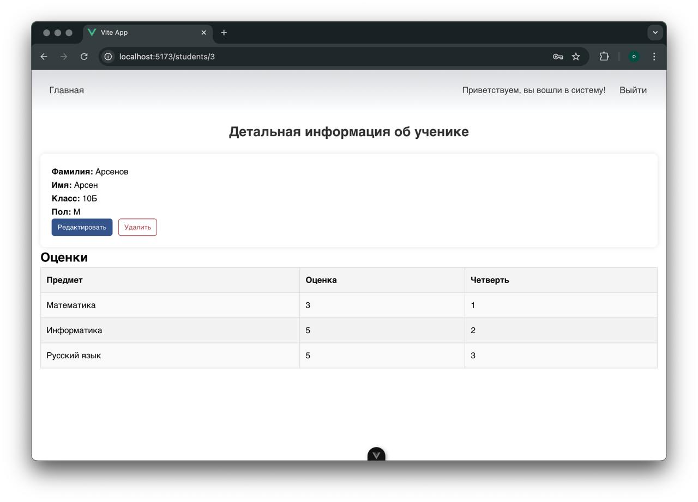
Аналогично я написала реализацию для списка учителей и детальной информаии по учителям:
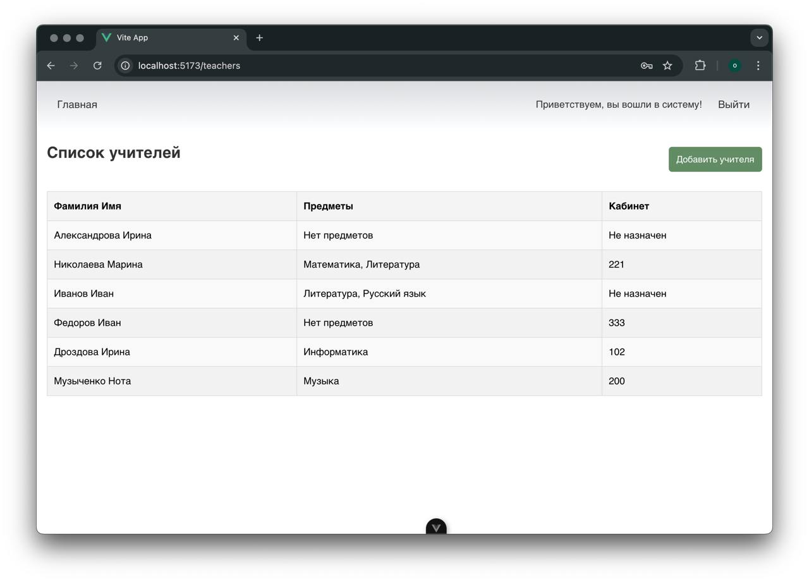
RoomsList.vue:
```
<template>
  <div>
    <Header />
    <div class="page-container">
      <div class="header-container">
        <h1 class="page-title">Список комнат</h1>
        <button @click="showAddRoomModal = true" class="add-button">Добавить комнату</button>
      </div>

      <div class="rooms-grid">
        <div
          v-for="room in rooms"
          :key="room.id_room"
          class="room-card"
          @click="openRoomDetails(room)"
        >
          <h2>Комната №{{ room.number }}</h2>
          <p>Статус: {{ room.status }}</p>
        </div>
      </div>

      <div v-if="showAddRoomModal" class="modal-overlay">
        <div class="modal-content">
          <form @submit.prevent="addRoom">
            <input v-model="newRoom.number" type="text" placeholder="Номер комнаты" required />
            <div class="status-select">
              <span>Выберите статус:</span>
              <button
                type="button"
                class="room-option"
                :class="{ active: newRoom.status === 'Базовая' }"
                @click="selectStatus('Базовая')"
              >
                Базовая
              </button>
              <button
                type="button"
                class="room-option"
                :class="{ active: newRoom.status === 'Оборудованная' }"
                @click="selectStatus('Оборудованная')"
              >
                Оборудованная
              </button>
            </div>
            <div class="modal-actions">
              <button type="submit" class="save-button">Сохранить</button>
              <button @click="closeModal" type="button" class="cancel-button">Отмена</button>
            </div>
          </form>
        </div>
      </div>

      <div v-if="selectedRoom" class="modal-overlay">
        <div class="modal-content">
          <h2>Комната №{{ selectedRoom.number }}</h2>
          <p>Статус: {{ selectedRoom.status }}</p>
          <div class="modal-actions">
            <button @click="deleteRoom" class="delete-button">Удалить комнату</button>
            <button @click="closeDetails" class="cancel-button">Закрыть</button>
          </div>
        </div>
      </div>
    </div>
  </div>
</template>

<script>
import Header from '@/components/Header.vue';
import apiClient from '@/api/axios';

export default {
  components: { Header },
  data() {
    return {
      rooms: [],
      showAddRoomModal: false,
      newRoom: {
        number: '',
        status: '',
      },
      selectedRoom: null,
    };
  },
  created() {
    this.fetchRooms();
  },
  methods: {
    async fetchRooms() {
      try {
        const response = await apiClient.get('rooms/');
        this.rooms = response.data.sort((a, b) => a.number - b.number);
      } catch (error) {
        console.error('Ошибка при загрузке комнат:', error);
      }
    },
    openRoomDetails(room) {
      this.selectedRoom = room;
    },
    closeDetails() {
      this.selectedRoom = null;
    },
    async addRoom() {
      try {
        const response = await apiClient.post('rooms/', this.newRoom);
        this.rooms.push(response.data);
        this.closeModal();
      } catch (error) {
        console.error('Ошибка при добавлении комнаты:', error);
      }
    },
    async deleteRoom() {
      if (confirm(`Вы уверены, что хотите удалить комнату №${this.selectedRoom.number}?`)) {
        try {
          await apiClient.delete(`rooms/${this.selectedRoom.id_room}/`);
          this.rooms = this.rooms.filter((room) => room.id_room !== this.selectedRoom.id_room);
          this.selectedRoom = null;
        } catch (error) {
          console.error('Ошибка при удалении комнаты:', error);
        }
      }
    },
    selectStatus(status) {
      this.newRoom.status = status;
    },
    closeModal() {
      this.showAddRoomModal = false;
      this.newRoom = { number: '', status: '' };
    },
  },
};
</script>
```
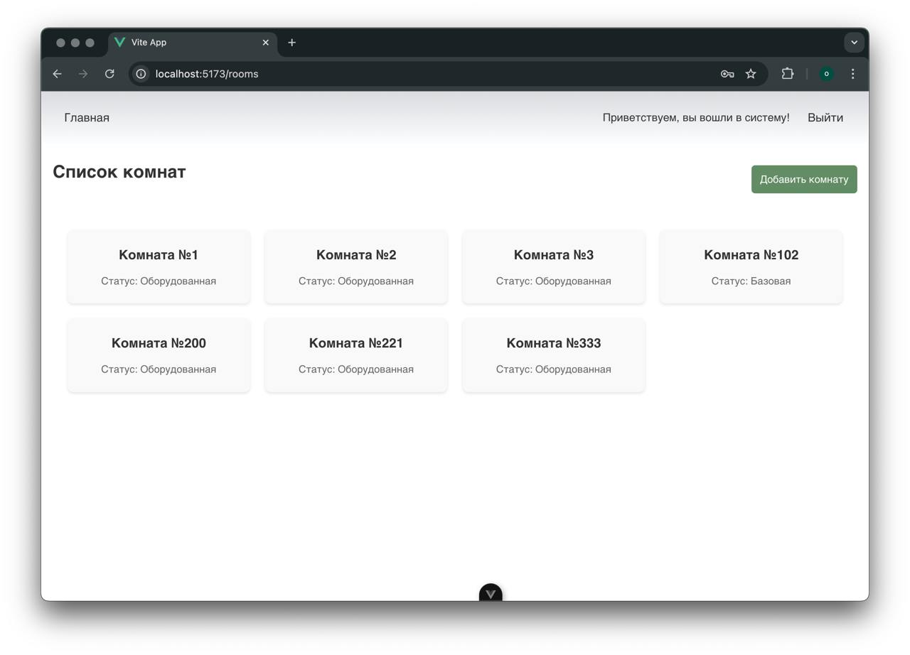
Lessons.vue:
```
<template>
  <div>
    <Header />
    <div class="page-container">
      <div class="header-container">
        <h1 class="page-title">Уроки</h1>
        <button @click="openAddLessonModal" class="add-button">Добавить новый урок</button>
      </div>

      <div v-if="showAddLessonModal" class="lesson-modal">
        <div class="modal-content">
          <form @submit.prevent="addLesson">

            <div class="form-group">
              <label for="subject">Предмет</label>
              <input v-model="newLesson.subject" type="text" id="subject" required placeholder="Введите название предмета" />
            </div>

            <div class="form-group">
              <label for="teacher">Учитель</label>
              <select v-model="newLesson.id_teacher" id="teacher" required>
                <option v-for="teacher in teachers" :key="teacher.id_teacher" :value="teacher.id_teacher">
                  {{ teacher.surname }} {{ teacher.name }} {{ teacher.room_assigned?.number }}
                </option>
              </select>
            </div>

            <div class="form-group">
              <label for="room">Комната</label>
              <select v-model="newLesson.room_assigned_id" id="room" required>
                <option v-for="room in rooms" :key="room.id_room" :value="room.id_room">
                  Комната №{{ room.number }} - {{ room.status }}
                </option>
              </select>
            </div>

            <div class="form-group">
              <label for="class_label">Класс</label>
              <input v-model="newLesson.class_label" type="text" id="class_label" required placeholder="Введите класс" />
            </div>

            <div class="form-group">
              <label for="day">День недели</label>
              <select v-model="newLesson.day" id="day" required>
                <option value="Понедельник">Понедельник</option>
                <option value="Вторник">Вторник</option>
                <option value="Среда">Среда</option>
                <option value="Четверг">Четверг</option>
                <option value="Пятница">Пятница</option>
                <option value="Суббота">Суббота</option>
              </select>
            </div>

            <div class="form-group">
              <label for="lesson_number">Номер урока</label>
              <div class="lesson-number-buttons">
                <button
                  v-for="n in 8"
                  :key="n"
                  type="button"
                  :class="['lesson-number-button', { selected: newLesson.lesson_number === n }]"
                  @click="newLesson.lesson_number = n"
                >
                  {{ n }}
                </button>
              </div>
            </div>

            <button type="submit" class="save-button">Сохранить</button>
            <button @click="closeAddLessonModal" class="cancel-button">Отмена</button>

          </form>
        </div>
      </div>

      <div v-if="showEditLessonModal" class="lesson-modal">
        <div class="modal-content">
          <form @submit.prevent="updateLesson">
            <h2>Редактировать урок</h2>
            <div class="form-group">
              <label for="edit-subject">Предмет</label>
              <input v-model="editableLesson.subject" type="text" id="edit-subject" required placeholder="Введите название предмета" />
            </div>
            <div class="form-group">
              <label for="edit-teacher">Учитель</label>
              <select v-model="editableLesson.id_teacher" id="edit-teacher" required>
                <option v-for="teacher in teachers" :key="teacher.id_teacher" :value="teacher.id_teacher">
                  {{ teacher.surname }} {{ teacher.name }} {{ teacher.room_assigned?.number }}
                </option>
              </select>
            </div>

            <div class="form-group">
              <label for="room">Комната</label>
              <select v-model="editableLesson.room_assigned_id" id="room" required>
                <option v-for="room in rooms" :key="room.id_room" :value="room.id_room">
                  Комната №{{ room.number }} - {{ room.status }}
                </option>
              </select>
            </div>

            <div class="form-group">
              <label for="class_label">Класс</label>
              <input v-model="editableLesson.class_label" type="text" id="class_label" required placeholder="Введите класс" />
            </div>

            <div class="form-group">
              <label for="day">День недели</label>
              <select v-model="editableLesson.day" id="day" required>
                <option value="Понедельник">Понедельник</option>
                <option value="Вторник">Вторник</option>
                <option value="Среда">Среда</option>
                <option value="Четверг">Четверг</option>
                <option value="Пятница">Пятница</option>
                <option value="Суббота">Суббота</option>
              </select>
            </div>

            <div class="form-group">
              <label for="lesson_number">Номер урока</label>
              <div class="lesson-number-buttons">
                <button
                  v-for="n in 8"
                  :key="n"
                  type="button"
                  :class="['lesson-number-button', { selected: editableLesson.lesson_number === n }]"
                  @click="editableLesson.lesson_number = n"
                >
                  {{ n }}
                </button>
              </div>
            </div>
            <button type="submit" class="save-button">Сохранить</button>
            <button @click="closeEditLessonModal" class="cancel-button">Отмена</button>
          </form>
        </div>
      </div>

      <div v-if="teachers.length > 0 && rooms.length > 0">
        <div v-for="(lessons, day) in lessonsByDay" :key="day" class="lesson-day">
          <h2>{{ day }}</h2>
          <div v-for="lesson in lessons" :key="lesson.id_lesson" class="lesson-card">
            <p><strong> {{lesson.lesson_number }} {{ lesson.subject }}</strong></p>
            <p>Учитель: {{ lesson.teacher }}</p>
            <p>Комната: {{ lesson.room }}</p>
            <p>Класс: {{ lesson.class_label }}</p>

            <div class="lesson-card-actions">
              <button @click="openEditLessonModal(lesson)" class="edit-button">Редактировать</button>
              <button @click.stop="deleteLesson(lesson.id_lesson)" class="delete-button">Удалить</button>
            </div>
          </div>
        </div>
      </div>
    </div>
  </div>
</template>

<script>
import Header from '@/components/Header.vue';
import apiClient from '@/api/axios';

export default {
  components: {
    Header,
  },
  data() {
    return {
      newLesson: {
        subject: '',
        id_teacher: null,
        room_assigned_id: null,
        class_label: '',
        day: '',
        lesson_number: null,
      },
      editableLesson: {},
      teachers: [],
      rooms: [],
      lessonsByDay: {},
      showModal: false,
      modalLesson: {},
      showAddLessonModal: false,
      showEditLessonModal: false,
    };
  },
  created() {
    this.fetchData();
  },
  methods: {
    async fetchData() {
      try {
        const [teachersResponse, roomsResponse] = await Promise.all([
          apiClient.get('teachers/'),
          apiClient.get('rooms/')
        ]);
        this.teachers = teachersResponse.data;
        this.rooms = roomsResponse.data;
        this.fetchLessons();
      } catch (error) {
        console.error('Ошибка при загрузке данных:', error);
      }
    },

    async fetchLessons() {
      try {
        const response = await apiClient.get('lessons/');
        const lessons = response.data;
        console.log('Загруженные уроки:', lessons);
        lessons.forEach(lesson => {
          const teacher = this.teachers.find(t => t.id_teacher === lesson.teacher);
          const room = this.rooms.find(r => r.id_room === lesson.room);

          lesson.teacher = teacher ? `${teacher.surname} ${teacher.name}` : 'Неизвестно';
          lesson.room = room ? `№${room.number}` : 'Не указан';
          lesson.class_label = lesson.class_label || 'Класс не указан';
        });
        this.lessonsByDay = this.organizeLessonsByDay(lessons);
      } catch (error) {
        console.error('Ошибка при загрузке данных уроков:', error);
      }
    },
    organizeLessonsByDay(lessons) {
      const lessonsByDay = {
        Понедельник: [],
        Вторник: [],
        Среда: [],
        Четверг: [],
        Пятница: [],
        Суббота: [],
      };

      lessons.forEach(lesson => {
        lessonsByDay[lesson.day].push(lesson);
      });

      for (const day in lessonsByDay) {
        lessonsByDay[day].sort((a, b) => a.lesson_number - b.lesson_number);
      }

      return lessonsByDay;
    },

    async addLesson() {
      try {
        if (!this.newLesson.id_teacher || !this.newLesson.room_assigned_id || !this.newLesson.class_label || !this.newLesson.subject) {
          alert('Пожалуйста, заполните все обязательные поля');
          return;
        }

        const newLesson = {
          subject: this.newLesson.subject,
          teacher: this.newLesson.id_teacher,
          room: this.newLesson.room_assigned_id,
          class_label: this.newLesson.class_label,
          day: this.newLesson.day,
          lesson_number: this.newLesson.lesson_number,
        };
        const response = await apiClient.post('lessons/', newLesson);
        this.lessonsByDay[response.data.day].push(response.data);
        this.resetNewLessonForm();
        this.closeAddLessonModal();
      } catch (error) {
        console.error('Ошибка при добавлении урока:', error);
        if (error.response) {
          console.error('Ответ от сервера:', error.response.data);
        }
      }
    },
    resetNewLessonForm() {
      this.newLesson = {
        subject: '',
        id_teacher: null,
        room_assigned_id: null,
        class_label: '',
        day: 'Понедельник',
        lesson_number: 1,
      };
    },
    openAddLessonModal() {
      this.showAddLessonModal = true;
    },
    closeAddLessonModal() {
      this.showAddLessonModal = false;
    },

    openEditLessonModal(lesson) {
      this.editableLesson = {
        id_lesson: lesson.id_lesson,
        subject: lesson.subject,
        id_teacher: lesson.id_teacher,
        room_assigned_id: lesson.room_assigned_id,
        class_label: lesson.class_label,
        day: lesson.day,
        lesson_number: lesson.lesson_number,
      };
      this.showEditLessonModal = true;
    },

    async updateLesson() {
      try {
        console.log('Данные для обновления:', this.editableLesson);
        await apiClient.put(`lessons/${this.editableLesson.id_lesson}/`, {
          subject: this.editableLesson.subject,
          teacher: this.editableLesson.id_teacher,
          room: this.editableLesson.room_assigned_id,
          class_label: this.editableLesson.class_label,
          day: this.editableLesson.day,
          lesson_number: this.editableLesson.lesson_number,
        });
        this.fetchLessons();
        this.closeEditLessonModal();
      } catch (error) {
        console.error('Ошибка при обновлении урока:', error.response?.data || error);
        alert(`Ошибка: ${JSON.stringify(error.response?.data || error)}`);
      }
    },

    closeEditLessonModal() {
      this.showEditLessonModal = false;
    },

    async deleteLesson(lessonId) {
      try {
        await apiClient.delete(`lessons/${lessonId}/`);
        this.fetchLessons();
        this.closeModal();
      } catch (error) {
        console.error('Ошибка при удалении урока:', error);
      }
    },
  },
};
</script>

```
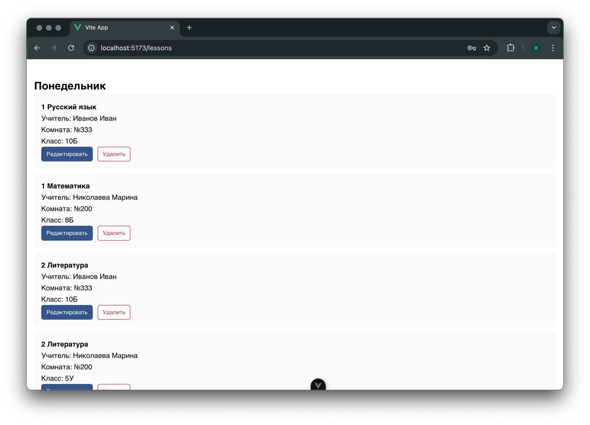
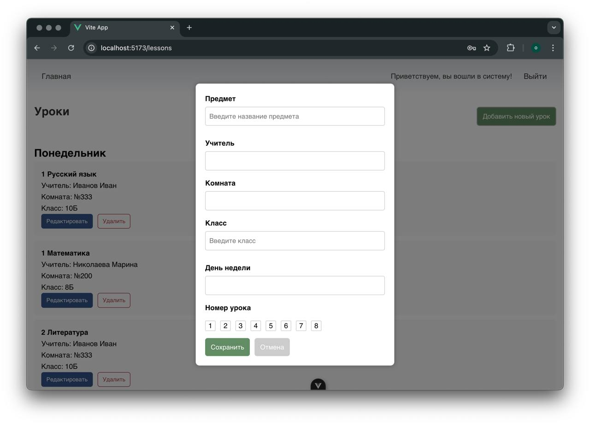
Список оценок для учеников по четвертям, Grades.vue:
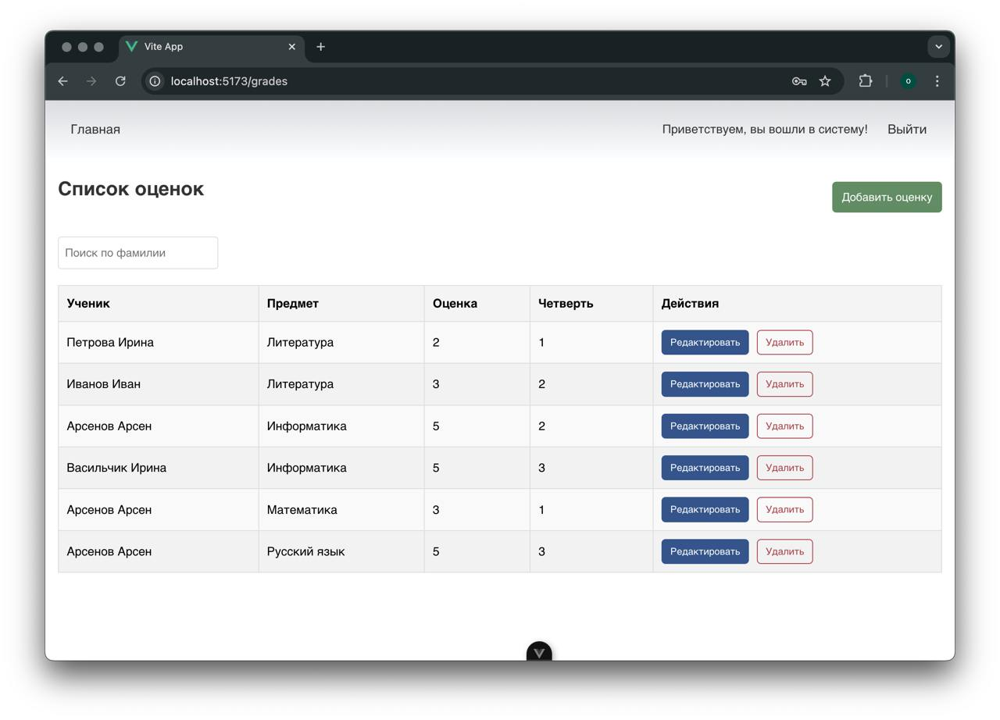
Генерация отчёта по классу, Report.Vue:
```
<template>
  <div>
    <Header />
    <div class="page-container">
      <h1>Генерация отчёта</h1>
      <div class="form-container">
        <label for="class-select" class="form-label-inline">Выберите класс:</label>
        <div class="select-container-inline">
          <select v-model="selectedClass" id="class-select" @change="fetchReportData" class="custom-select">
            <option value="" disabled selected>Выберите класс...</option>
            <option v-for="className in classOptions" :key="className" :value="className">
              {{ className }}
            </option>
          </select>
        </div>
      </div>

      <div v-if="selectedClass && reportData" class="report-content">
        <h2>{{ selectedClass }} Класс</h2>

        <div class="gender-count">
          <p>Количество мальчиков: {{ reportData.genderCount.boys }}</p>
          <p>Количество девочек: {{ reportData.genderCount.girls }}</p>
        </div>

        <h3>Список учеников:</h3>
        <table class="students-table">
          <thead>
            <tr>
              <th>Фамилия</th>
              <th>Имя</th>
            </tr>
          </thead>
          <tbody>
            <tr v-for="student in reportData.students" :key="student.id_student">
              <td>{{ student.surname }}</td>
              <td>{{ student.name }}</td>
            </tr>
          </tbody>
        </table>

        <h3>Список уроков:</h3>
        <table class="lessons-table">
          <thead>
            <tr>
              <th>День</th>
              <th>Номер урока</th>
              <th>Предмет</th>
              <th>Кабинет</th>
            </tr>
          </thead>
          <tbody>
            <tr v-for="lesson in enrichedLessons" :key="lesson.id_lesson">
              <td>{{ lesson.day }}</td>
              <td>{{ lesson.lesson_number }}</td>
              <td>{{ lesson.subject }}</td>
              <td>{{ lesson.room_number }}</td>
            </tr>
          </tbody>
        </table>
      </div>

      <div v-else-if="selectedClass" class="loading-message">
        <p>Загружаем данные для класса {{ selectedClass }}...</p>
      </div>
    </div>
  </div>
</template>

<script>
import Header from "@/components/Header.vue";
import apiClient from "@/api/axios";

export default {
  components: { Header },
  data() {
    return {
      classOptions: [],
      selectedClass: null,
      reportData: null,
      rooms: [],
    };
  },
  computed: {
    enrichedLessons() {
      if (!this.reportData || !this.reportData.lessons) return [];
      const daysOfWeek = ["Понедельник", "Вторник", "Среда", "Четверг", "Пятница", "Суббота"];
      return this.reportData.lessons
        .map((lesson) => {
          const room = this.rooms.find((room) => room.id_room === lesson.room);
          return {
            ...lesson,
            room_number: room ? room.number : "Неизвестно",
          };
        })
        .sort((a, b) => {
          const dayA = daysOfWeek.indexOf(a.day);
          const dayB = daysOfWeek.indexOf(b.day);
          if (dayA !== dayB) {
            return dayA - dayB;
          }
          return a.lesson_number - b.lesson_number;
        });
    },
  },
  created() {
    this.fetchClasses();
    this.fetchRooms();
  },
  methods: {
    async fetchClasses() {
      try {
        const response = await apiClient.get("students/");
        const uniqueClasses = [
          ...new Set(response.data.map((student) => student.class_name)),
        ];
        this.classOptions = uniqueClasses;
      } catch (error) {
        console.error("Ошибка при загрузке классов:", error);
      }
    },
    async fetchRooms() {
      try {
        const response = await apiClient.get("rooms/");
        this.rooms = response.data;
      } catch (error) {
        console.error("Ошибка при загрузке данных кабинетов:", error);
      }
    },
    async fetchReportData() {
      if (!this.selectedClass) return;

      try {
        const studentsResponse = await apiClient.get("students/");
        const students = studentsResponse.data.filter(
          (student) => student.class_name === this.selectedClass
        );

        const genderCount = {
          boys: students.filter((student) => student.gender === "М").length,
          girls: students.filter((student) => student.gender === "Ж").length,
        };

        const lessonsResponse = await apiClient.get("lessons/");
        const lessons = lessonsResponse.data.filter(
          (lesson) => lesson.class_label === this.selectedClass
        );

        this.reportData = {
          students,
          genderCount,
          lessons,
        };
      } catch (error) {
        console.error("Ошибка при загрузке данных отчёта:", error);
      }
    },
  },
};
</script>
```
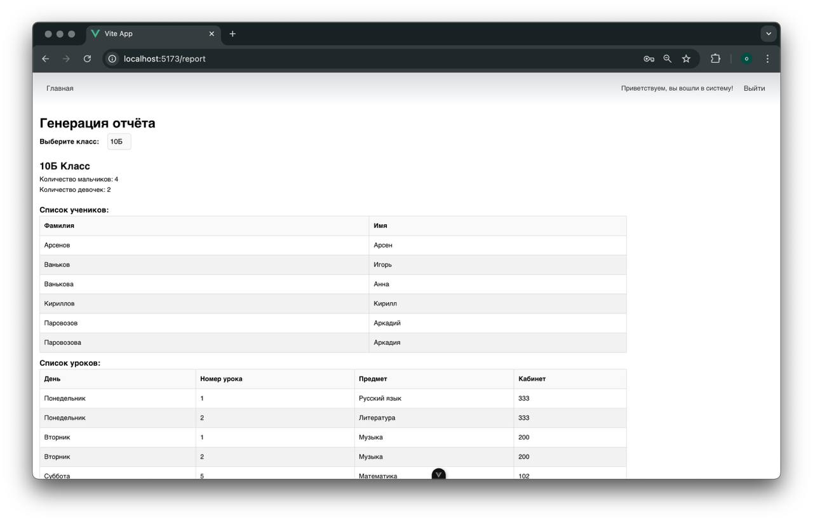
