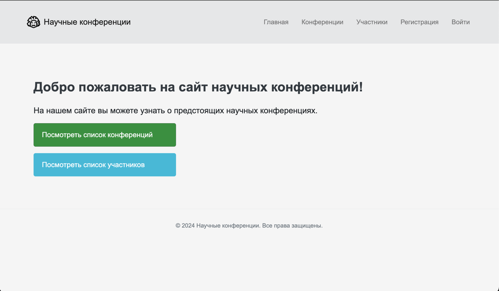
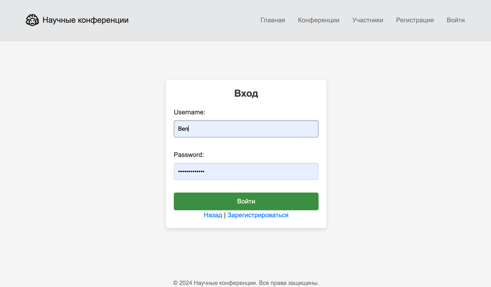
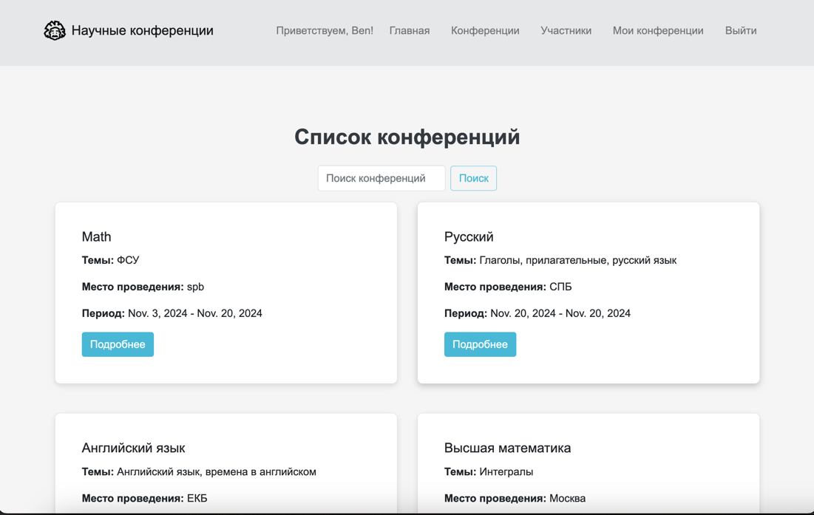
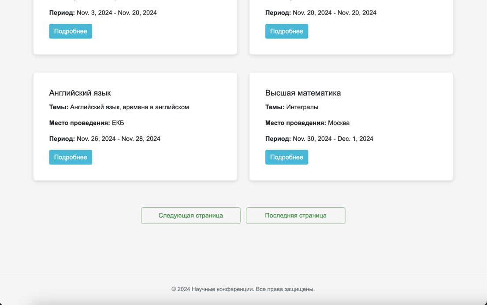
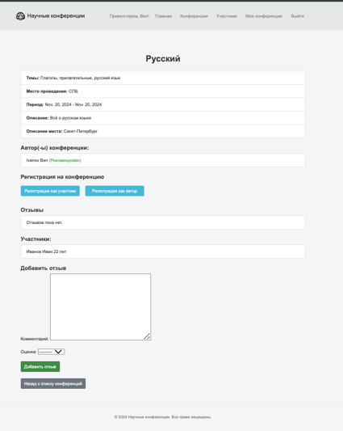
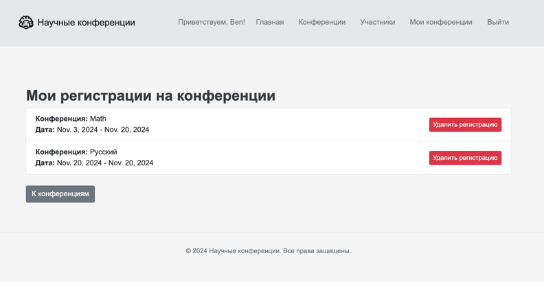
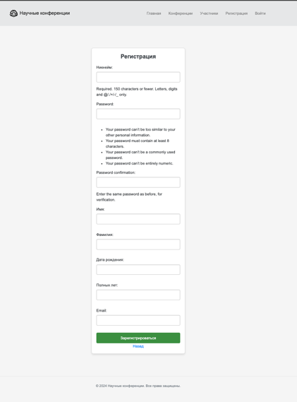
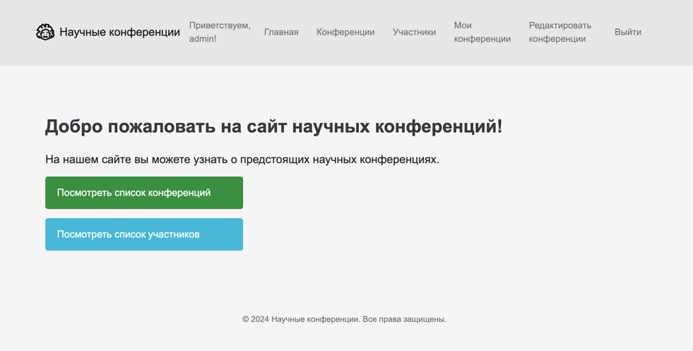

## Кастомизация, добавление navbar и пагинации
В рамках данного этапа работы были реализованы следующие ключевые компоненты интерфейса:

- Я создала общий шаблона design.html
Для унификации стилей и структуры страниц.   
design.html
```html
    <!DOCTYPE html>
    <html lang="ru">
    <head>
       <meta charset="UTF-8">
       <meta name="viewport" content="width=device-width, initial-scale=1">
       <title>Главная страница</title>
    
       <link href="https://stackpath.bootstrapcdn.com/bootstrap/4.5.2/css/bootstrap.min.css" rel="stylesheet">
       
       <link href="" rel="stylesheet">
    </head>
    <body>
        <nav class="navbar navbar-expand-lg navbar-light" style="background-color: #e6e7e8;">
            <div class="container d-flex align-items-center">
                <a class="navbar-brand d-flex align-items-center" href="">
                    
                    Научные конференции
                </a>
                <button class="navbar-toggler" type="button" data-toggle="collapse" data-target="#navbarNav" aria-controls="navbarNav" aria-expanded="false" aria-label="Toggle navigation">
                    <span class="navbar-toggler-icon"></span>
                </button>
                <div class="collapse navbar-collapse justify-content-end" id="navbarNav">
                    <ul class="navbar-nav align-items-center" style="font-size: 1em;">
                        
                            <li class="nav-item mr-3">
                                <span class="navbar-text">Приветствуем, {{ user.username }}!</span>
                            </li>
                        
                        <li class="nav-item mr-3">
                            <a class="nav-link" href="">Главная</a>
                        </li>
                        <li class="nav-item mr-3">
                            <a class="nav-link" href="">Конференции</a>
                        </li>
                        <li class="nav-item mr-3">
                            <a class="nav-link" href="">Участники</a>
                        </li>
    
                        
                            
                                <li class="nav-item mr-3">
                                    <a class="nav-link" href="">Мои конференции</a>
                                </li>
                                <li class="nav-item mr-3">
                                    <a class="nav-link" href="/admin/">Редактировать конференции</a>
                                </li>
                            
                                <li class="nav-item mr-3">
                                    <a class="nav-link" href="">Мои конференции</a>
                                </li>
                            
                            <li class="nav-item mr-3">
                                <form method="post" action="" class="m-0 p-0">
                                    
                                    <button type="submit" class="btn btn-link nav-link" style="font-size: 1em;">Выйти</button>
                                </form>
                            </li>
                        
                            <li class="nav-item mr-3">
                                <a class="nav-link" href="">Регистрация</a>
                            </li>
                            <li class="nav-item">
                                <a class="nav-link" href="">Войти</a>
                            </li>
                        
                    </ul>
                </div>
            </div>
        </nav>
    
        <div class="container my-4">
            
        </div>
    
        <footer class="footer">
            <div class="container text-center">
                <span>&copy; 2024 Научные конференции. Все права защищены.</span>
            </div>
        </footer>
    </body>
    </html>
```
С использованием  Bootstrap 4.5.2 я реализовала меню навигации. 
Также на странице списка конференций, я добавила пагинацию и поиск.
conference_list.html:
```html
<

Список конференций


<div class="container my-4">
    <h1 class="text-center mb-4">Список конференций</h1>

    
        <div class="alert alert-success">
            
                {{ message }}
            
        </div>
    

    <form method="get" action="" class="form-inline justify-content-center mb-3">
        <input type="text" name="q" class="form-control mr-2" placeholder="Поиск конференций" value="{{ request.GET.q }}">
        <button type="submit" class="btn btn-outline-primary search">Поиск</button>
    </form>

    <div class="row justify-content-center">
        
            <div class="col-md-6 mb-4">
                <div class="card conference-card">
                    <div class="card-body">
                        <h5 class="card-title">{{ conference.title }}</h5>
                        <p class="card-text"><strong>Темы:</strong> {{ conference.themes }}</p>
                        <p class="card-text"><strong>Место проведения:</strong> {{ conference.location }}</p>
                        <p class="card-text"><strong>Период:</strong> {{ conference.start_date }} - {{ conference.end_date }}</p>
                        <p class="card-text">{{ 307080conference.description|truncatewords:20 }}</p>
                        <a href="" class="btn btn-info">Подробнее</a>
                    </div>
                </div>
            </div>
        
            <p>Конференции не найдены.</p>
        
    </div>

    <div class="custom-pagination d-flex justify-content-center mt-4">
        <nav aria-label="Page navigation">
            <ul class="pagination d-flex">
                
                    <li class="page-item mx-2">
                        <a class="page-link custom-page-link" href="?page=1&q={{ query }}">
                            Первая страница
                        </a>
                    </li>
                    <li class="page-item mx-2">
                        <a class="page-link custom-page-link" href="?page={{ page_obj.previous_page_number }}&q={{ query }}">
                            Предыдущая страница
                        </a>
                    </li>
                

                
                    <li class="page-item mx-2">
                        <a class="page-link custom-page-link" href="?page={{ page_obj.next_page_number }}&q={{ query }}">
                            Следующая страница
                        </a>
                    </li>
                    <li class="page-item mx-2">
                        <a class="page-link custom-page-link" href="?page={{ paginator.num_pages }}&q={{ query }}">
                            Последняя страница
                        </a>
                    </li>
                
            </ul>
        </nav>
    </div>
</div>

```
## Реализованные страницы:









Также, если пользователь является админом, то его меню выглядит так: 

Здесь пользователь может перейти в панель django-administration, и, соответственно вносить необходимые правки или подтверждать (рекоммендовать) автора.
